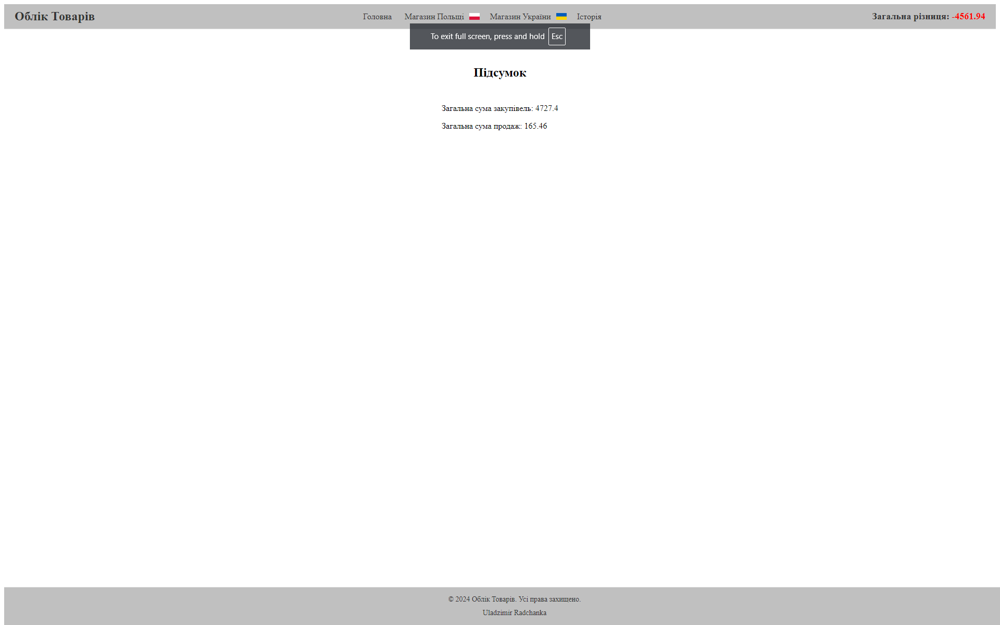
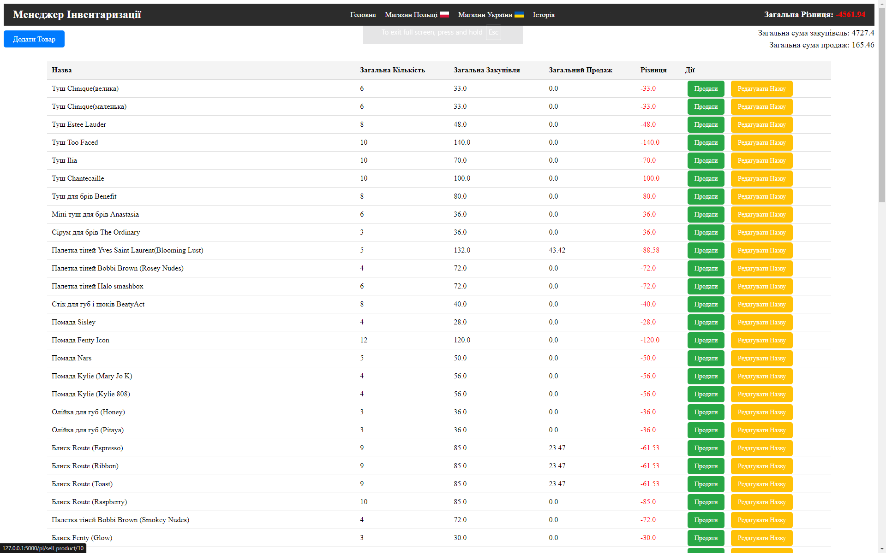

# **Flask Inventory Manager**

## Description
Flask Inventory Manager is a web application for managing inventory, developed using Flask. It allows you to keep track of products for multiple stores, record purchases and sales, and manage transaction history.

## Tools Used

- **Flask**: A web framework for building web applications in Python.
- **Flask-SQLAlchemy**: Flask extension for working with SQLAlchemy databases.
- **SQLite**: Lightweight database for storing data.
- **Jinja2**: Templating engine for dynamic HTML page generation.

## Key Features

- **Multi-store Management**: Manage inventory for Polish and Ukrainian stores.
- **Product Addition and Sales**: Handle stock management and sales transactions.
- **Transaction History**: View and edit purchase and sales history.
- **Product Editing**: Ability to change product names and adjust historical data.

## Screenshots

### Main Page

### Inventory Management Page

## License

This project is licensed under the MIT License. See [LICENSE](LICENSE) for more details.